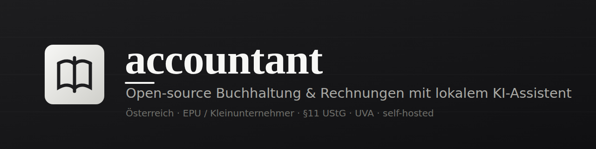
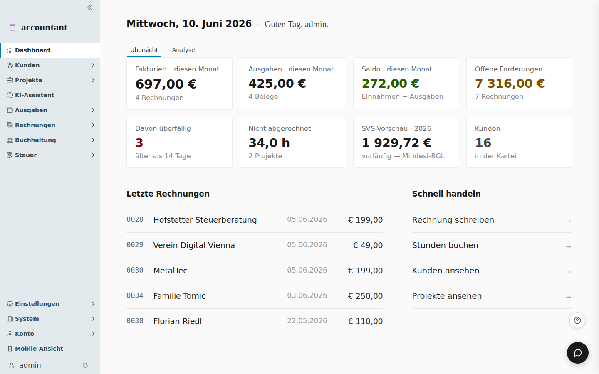
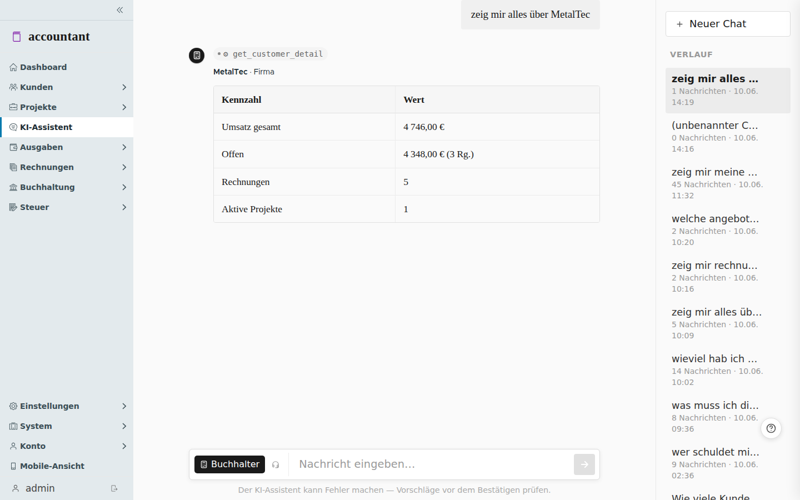

<div align="center">

</div>

<br>

Selbst-gehostete Buchhaltung für österreichische EPUs, Freiberufler und Kleinunternehmer. Ein Docker-Container, SQLite, keine Cloud. Dazu ein KI-Assistent, der lokal läuft und Fragen zu deinen Daten beantwortet oder nach Bestätigung bucht.

[](LICENSE)
[](#entwicklung)



## Schnellstart

Nur die App:

```bash
cp .env.example .env      # SESSION_SECRET setzen: openssl rand -hex 32
docker compose up -d
```

Komplettpaket mit lokalem LLM (Ollama) und Paperless-ngx, vorkonfiguriert:

```bash
cp .env.example .env
docker compose -f docker-compose.full.yml up -d
docker compose -f docker-compose.full.yml exec ollama ollama pull llama3.2:3b
```

Dann `http://localhost:6002` öffnen. Erster Login `admin` / `admin`, wird sofort zur Änderung gezwungen. Hinter einem HTTPS-Reverse-Proxy zusätzlich `SESSION_COOKIE_SECURE=true` setzen.

## Funktionen

Rechnungen nach §11 UStG (Reverse-Charge, Kleinunternehmer), Festschreibung nach §131 BAO mit Audit-Log, Mahnwesen, Projekte mit Zeiterfassung, Ausgaben mit Beleg-OCR und Paperless-ngx, Angebote, wiederkehrende Rechnungen, AT-Steuer (UVA, ZM, SVS- und ESt-Vorschau, BMD- und Finanzamt-Export), Anlagen mit AfA, Reisekosten, Kassabuch, XRechnung 3.0, Bank-Abgleich, automatische Backups und der lokale KI-Assistent.

Wie alles im Detail funktioniert, steht im **[Handbuch](docs/manual/)** (38 Kapitel, auch in der App unter „Handbuch" eingebaut). Direkt zu den wichtigsten:

* [Installation](docs/manual/01-installation.md) · [Erste Schritte](docs/manual/02-erste-schritte.md) · [Firmen-Einstellungen](docs/manual/03-firmen-einstellungen.md)
* [KI-Assistent](docs/manual/11-ki-assistent.md) · [USt-Voranmeldung](docs/manual/13-uva.md) · [Mahnwesen](docs/manual/12-mahnwesen.md)
* [Reverse-Charge](docs/manual/05-reverse-charge.md) · [Kleinunternehmer](docs/manual/06-kleinunternehmer.md) · [Backup](docs/manual/15-backup.md)

## KI-Assistent

Frag in normaler Sprache, auch umgangssprachlich. Der Assistent holt die echten Daten und antwortet mit sauberen Tabellen, Schreibvorgänge erst nach deiner Bestätigung.



Läuft gegen jeden OpenAI-kompatiblen Endpoint: Ollama, llama.cpp, LM Studio oder [llama-tq](https://github.com/LL4nc33/llama-tq) (llama.cpp-Fork mit mehr Durchsatz). Deine Daten bleiben auf dem Server. Funktioniert mit kleinen Modellen ab 3B. Endpoint setzt du per Umgebungsvariable (im Komplettpaket schon gesetzt) oder in der App unter Firma → KI-Assistent. Details: [Handbuch, Kapitel 11](docs/manual/11-ki-assistent.md).

## Konfiguration

| Variable | Default | Zweck |
|---|---|---|
| `SESSION_SECRET` | zufällig | In Produktion fest setzen, sonst gehen Sessions bei Neustart verloren |
| `SESSION_COOKIE_SECURE` | `false` | `true` hinter HTTPS-Reverse-Proxy |
| `DATA_DIR` | `./data` | Persistente Daten (SQLite, Sessions, Suchindex) |
| `PORT` | `6002` | Lauschport |
| `LLM_BASE_URL`, `LLM_MODEL` | leer | KI-Endpoint, im Komplettpaket vorbelegt |
| `PAPERLESS_URL`, `PAPERLESS_TOKEN` | leer | Paperless-Anbindung, URL im Komplettpaket vorbelegt |

## Entwicklung

```bash
npm install
npm run dev-node     # Express + SQLite auf Port 6002
npm run dev          # Angular Dev-Server, /api wird auf 6002 geproxyt
```

Tests mit `npm test`, Produktions-Build mit `npm run build`. Geteilte Entities in `src/shared/entities`, Server in `src/server`, App in `src/app`.

## Lizenz

[AGPL-3.0-only](LICENSE). Wer accountant verändert und über ein Netzwerk anbietet, muss die geänderte Quelle den Nutzern zugänglich machen (§13 AGPL). Für die eigene Firma self-hosted gibt es außer der Lizenz-Notice nichts zu beachten.
